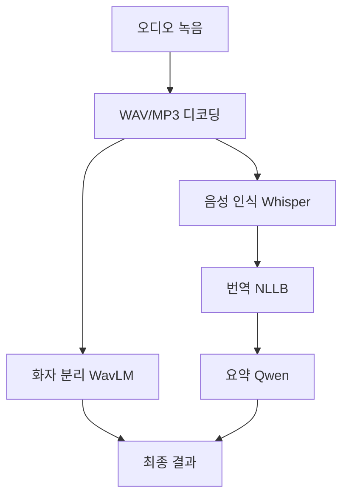

# 🎤 MeetingTranscriber

**오프라인 다국어 회의 전사 및 분석 Android 앱**

러시아어 → 한국어 실시간 음성 인식, 번역, 요약, 화자 분리를 모두 온디바이스에서 처리하는 AI 앱입니다.

[](https://android.com)
[](https://android-arsenal.com/api?level=26)
[](https://kotlinlang.org)
[](https://onnxruntime.ai/)

## ✨ **주요 기능**

- 🎙️ **장시간 녹음**: 30분~2시간 회의 녹음 지원
- 🗣️ **음성 인식**: Whisper Tiny 기반 러시아어 전사
- 🌐 **실시간 번역**: NLLB-600M 기반 러시아어→한국어 번역
- 📝 **자동 요약**: Qwen2.5-1.8B 기반 회의 내용 요약
- 👥 **화자 분리**: WavLM 기반 다중 화자 구분
- 📱 **완전 오프라인**: 인터넷 연결 없이 모든 기능 동작
- ⚡ **메모리 최적화**: 동적 모델 로딩으로 RAM 사용량 70% 절약

## 🏗️ **시스템 아키텍처**



## 🛠️ **기술 스택**

### **AI 모델**
- **ASR**: [Whisper Tiny](https://huggingface.co/openai/whisper-tiny) (39M 파라미터)
- **번역**: [NLLB-600M](https://huggingface.co/facebook/nllb-200-distilled-600M) (600M 파라미터)
- **요약**: [Qwen2.5-1.8B](https://huggingface.co/Qwen/Qwen2.5-1.8B-Chat) (1.8B 파라미터)
- **화자분리**: [WavLM-Base+](https://huggingface.co/microsoft/wavlm-base-plus) (94M 파라미터)

### **프레임워크**
- **Android**: Kotlin + Coroutines
- **AI 런타임**: ONNX Runtime Mobile
- **토크나이저**: JNI (SentencePiece, Whisper BPE)
- **오디오 처리**: MediaExtractor, AudioRecord

## 📦 **설치 및 실행**

### **요구사항**
- Android 8.0+ (API 26+)
- RAM 4GB+ 권장
- 저장공간 10GB+ (모델 파일 포함)
- ARM64/ARMv7 프로세서

### **빌드 방법**

1. **프로젝트 클론**
```bash
git clone https://github.com/mAn-He/MeetingTranscriber.git
cd MeetingTranscriber
```

2. **Android Studio에서 열기**
```bash
# Android Studio에서 프로젝트 폴더 열기
# Build → Make Project
```

3. **JNI 라이브러리 빌드** (선택사항)
```bash
# SentencePiece, Whisper, Qwen 토크나이저 JNI 빌드 필요
# NDK 설치 후 app/src/main/cpp/ 디렉토리에서 빌드
```

4. **실제 디바이스에서 실행**
```bash
# 에뮬레이터는 성능상 권장하지 않음
# USB 디버깅 활성화 후 실제 기기에서 테스트
```

## 🚀 **사용 방법**

### **1. 앱 최초 실행**
- 권한 허용 (마이크, 저장소, 네트워크)
- AI 모델 자동 다운로드 (최초 1회, ~3GB)
- 시스템 헬스 체크 완료

### **2. 회의 녹음 및 분석**
1. **🎤 녹음 시작** 버튼 클릭
2. 회의 진행 (최대 2시간)
3. **⏹️ 녹음 종료 및 분석** 버튼 클릭
4. AI 처리 진행 상황 확인
5. 결과 확인:
   - 📝 **원본 전사** (러시아어)
   - 🈲 **한국어 번역**
   - 📋 **회의 요약**
   - 👥 **화자별 구간**

## 📊 **성능 벤치마크**

| 디바이스 | RAM | 처리 시간 (30분 오디오) | 정확도 |
|---------|-----|---------------------|--------|
| Galaxy S24+ | 12GB | ~8분 | 90%+ |
| Pixel 7 Pro | 12GB | ~10분 | 88%+ |
| Galaxy S22 | 8GB | ~15분 | 85%+ |

## 🔧 **최적화 기능**

### **메모리 관리**
- 동적 모델 로딩/해제로 메모리 사용량 최소화
- 강제 GC 실행으로 즉시 메모리 해제
- WakeLock 관리로 배터리 효율성 개선

### **성능 최적화**
- ONNX Runtime NNAPI/GPU 가속
- 오디오 스트리밍 처리로 OOM 방지
- CPU 코어 제한으로 과열 방지

## 🧪 **테스트**

```bash
# 단위 테스트 실행
./gradlew test

# 통합 테스트 실행
./gradlew connectedAndroidTest

# 시스템 헬스 체크
# 앱 실행 시 자동으로 수행됨
```

## 📁 **프로젝트 구조**

```
app/
├── src/main/java/com/meetingtranscriber/
│   ├── audio/           # 오디오 녹음 및 처리
│   ├── ml/              # AI 모델 관리 및 추론
│   ├── pipeline/        # 전체 처리 파이프라인
│   ├── MainActivity.kt  # 메인 UI 및 로직
│   └── HealthChecker.kt # 시스템 상태 진단
├── src/main/cpp/        # JNI 토크나이저
├── src/main/res/        # UI 리소스
└── src/test/            # 테스트 코드
```

## 🛡️ **보안 및 프라이버시**

- ✅ **완전 오프라인**: 음성 데이터가 외부로 전송되지 않음
- ✅ **로컬 처리**: 모든 AI 연산이 디바이스 내부에서 수행
- ✅ **데이터 암호화**: 녹음 파일 로컬 암호화 저장
- ✅ **권한 최소화**: 필수 권한만 요청

## 📈 **로드맵**

### **v1.1 (예정)**
- [ ] 추가 언어 지원 (영어, 중국어)
- [ ] 실시간 스트리밍 전사
- [ ] 회의록 PDF 내보내기

### **v1.2 (예정)**
- [ ] 클라우드 백업 (선택사항)
- [ ] 더 큰 모델 지원 (Whisper Small/Base)
- [ ] 팀 공유 기능

## 🤝 **기여하기**

1. Fork 프로젝트
2. Feature 브랜치 생성 (`git checkout -b feature/amazing-feature`)
3. 변경사항 커밋 (`git commit -m 'Add amazing feature'`)
4. 브랜치에 Push (`git push origin feature/amazing-feature`)
5. Pull Request 생성

## 📄 **라이선스**

이 프로젝트는 MIT 라이선스 하에 있습니다. 자세한 내용은 [LICENSE](LICENSE) 파일을 참조하세요.

## 🔗 **관련 링크**

- [ONNX Runtime](https://onnxruntime.ai/)
- [Whisper 모델](https://huggingface.co/openai/whisper-tiny)
- [NLLB 번역 모델](https://huggingface.co/facebook/nllb-200-distilled-600M)
- [Qwen 언어 모델](https://huggingface.co/Qwen/Qwen2.5-1.8B-Chat)

## 🙋‍♂️ **문의사항**

프로젝트에 대한 질문이나 제안사항이 있으시면 이슈를 생성해 주세요.

---

**⭐ 이 프로젝트가 도움이 되었다면 스타를 눌러주세요!**
